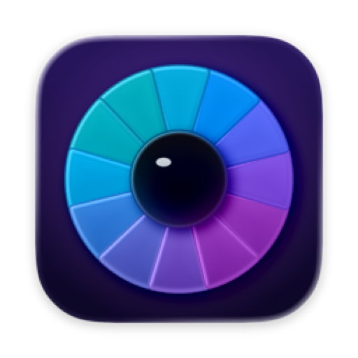
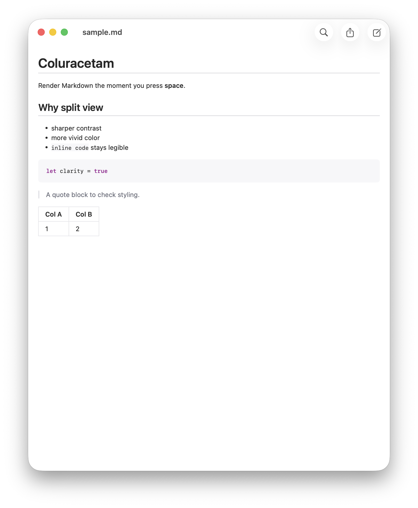
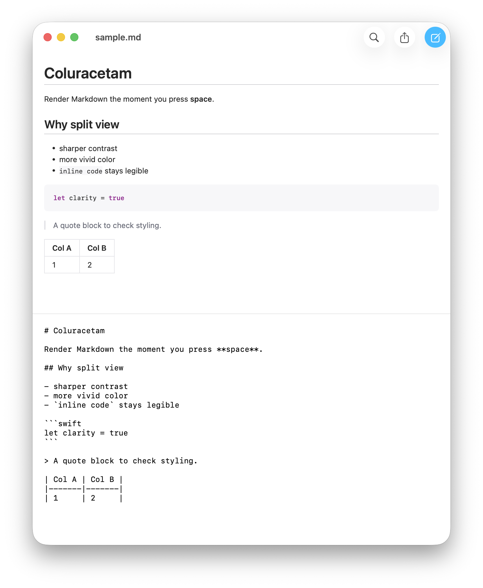

<div align="center">

[](https://kagerou.glass)



# coluracetam

**rx no. 010 ・ col·ur·ac·e·tam /ˌkɒljʊəˈræsɪtæm/ ・ a racetam for the things you read ♡**

[](https://kagerou.glass/coluracetam/)
[](https://x.com/kageroumado)
[](#requirements)

<a href="https://apps.apple.com/app/apple-store/id6788680916?pt=128650112&ct=GitHub&mt=8"></a>

<table>
  <tr>
    <td align="center"><br><sub><b>rendered</b> ・ press space, read it in color</sub></td>
    <td align="center"><br><sub><b>live split</b> ・ source below, preview above, aligned to the pixel</sub></td>
  </tr>
</table>

</div>

> **服用注意 ・ for documents that deserve to be seen, not just parsed.**
>
> A `.md` file is color-blind by default — Finder hands you raw asterisks and pipes, a flat gray wall
> of syntax. Coluracetam is the racetam for that wall: press **space** and the Markdown *resolves* —
> headings find their weight, code keeps its grain, tables draw their rules — and it's the **same**
> vivid rendering in the app, in Quick Look, and on the Finder thumbnail. Edit the source in a live
> split and watch it sharpen as you type. It does one small thing well: it lets you *see* what you
> wrote. ♡

---

A native macOS Markdown reader that renders the moment you press **space**.

Coluracetam is a document app *and* a pair of Quick Look extensions, sharing one rendering path. Open
a `.md` file for a clean GitHub-styled read with zoom, find, and export; or never open it at all —
just press space in Finder and get the same rendering inline, with thumbnails to match. When you do
want to write, toggle the live split: rendered preview on top, raw source below, updating as you type.

## Features

- **Press space, read it in color.** A Quick Look **Preview** extension renders Markdown the instant you select a `.md` file and hit space in Finder — GitHub-styled, light and dark, no app launch.
- **Thumbnails that actually read.** A Quick Look **Thumbnail** extension paints rendered Markdown onto the Finder icon, so a folder of notes looks like notes, not gray text.
- **Live split editor.** Toggle edit and the window splits — rendered preview on top, raw source below, margins aligned to the pixel. Type in one, watch the other sharpen; no mode flip, no separate preview window.
- **One render path, everywhere.** The app's read view, the Quick Look preview, and the thumbnail all draw through the same `ColuracetamKit` renderer, so what you see is byte-for-byte identical across all three.
- **Find that counts.** Find in the rendered text highlights every occurrence (case- and diacritic-insensitive) with a live match count; the editor pane uses the native find bar, kept in sync with the toolbar.
- **Reading-comfort zoom.** `⌘+` / `⌘−` / `⌘0` scale the text 0.5×–3× for comfortable reading without touching the file.
- **Export.** Save the rendered document to **PDF** or a self-contained **HTML** file.
- **Auto-reload, edit-safe.** Watches the file on disk and pulls in external changes automatically — but never clobbers unsaved edits in your buffer.
- **Plain files, no lock-in.** Opens and saves ordinary UTF-8 `.md` / `.markdown`. No database, no sidecar, no proprietary format.

## Requirements

- **macOS Tahoe 26.4.** That's what I build and test on; it likely runs on earlier 26.x, but I haven't tested it there.
- **Xcode 26+** to build, with Swift 6 strict concurrency enabled.

## Download

- **[Mac App Store](https://apps.apple.com/app/apple-store/id6788680916?pt=128650112&ct=GitHub&mt=8)** — $4.99. The same reader, sandboxed and updated through the store. Since the DMG below is free, buying this copy is a deliberate act: it pays for the hours this app took and the apps that come next. If that's the copy on your Mac — thank you. ♡
- **[GitHub Releases](https://github.com/kageroumado/coluracetam/releases/latest)** — free, MIT, notarized DMG.

Or build it yourself — it's a single Run in Xcode.

## Building

```sh
git clone https://github.com/kageroumado/coluracetam.git
cd coluracetam
open Coluracetam.xcodeproj
```

In Xcode, select the **Coluracetam** scheme and Run. Set a development team for code signing — the two
Quick Look app extensions are embedded into the app bundle and registered with the system when the app
launches, so they need to sign under the same team.

For a headless compile check without local signing identities:

```sh
xcodebuild -project Coluracetam.xcodeproj -scheme Coluracetam -configuration Debug \
  -destination 'generic/platform=macOS' \
  CODE_SIGNING_ALLOWED=NO CODE_SIGNING_REQUIRED=NO CODE_SIGN_IDENTITY='' build
```

The renderer builds and tests standalone as a Swift package:

```sh
cd coluracetam-kit
swift test
```

## How it works

Everything you see — in the app, in Quick Look, on the thumbnail — comes out of one view.

- **`ColuracetamKit` owns rendering.** `MarkdownRenderView` parses Markdown into styled SwiftUI text via [Textual](https://github.com/gonzalezreal/textual)'s `StructuredText` (GitHub preset: heading scale, dividers, code-block backgrounds, table rules). The app's read view, the preview extension, and the thumbnail extension each instantiate it, so the three can't drift.
- **The live split is a `VSplitView`.** The same `MarkdownRenderView` sits on top; the source pane below is a small AppKit-backed editor whose text-container inset is matched to the preview's 20-pt padding, so the two columns line up exactly. SwiftUI's `TextEditor` can't do that — it ignores horizontal content insets — which is the whole reason the editor is bridged.
- **File watching is structured.** A `DispatchSource` file-system watch is wrapped in an `AsyncStream` and consumed from a SwiftUI `.task`. Atomic saves (write-temp-then-rename, the common editor pattern) swap the inode out, so the watch re-arms against the path on delete/rename.

## Architecture

```
┌─────────────────────────────────────────────────┐
│  Coluracetam.app   (SwiftUI DocumentGroup)       │
│  • read view · live split editor · zoom · find   │
│  • export PDF / HTML · file-watch auto-reload    │
└────────────────────────┬────────────────────────┘
                         │ imports
                         ▼
┌─────────────────────────────────────────────────┐
│  ColuracetamKit   (Swift package)                │
│  the one render path shared by all three surfaces│
│  • MarkdownRenderView · find highlight · export  │
└──────────┬───────────────────────────┬──────────┘
           │ imports                    │ imports
           ▼                            ▼
┌────────────────────────┐   ┌────────────────────────┐
│ QuickLookPreview.appex  │   │ QuickLookThumbnail.appex│
│ • spacebar in Finder    │   │ • rendered thumbnails   │
└────────────────────────┘   └────────────────────────┘
```

## Quirks worth knowing

- **The render path is read-only by design.** Textual turns Markdown into immutable SwiftUI `Text`; it can't be edited in place. So editing is a *separate* AppKit text view, and the "live preview" is simply that same render re-run on each keystroke — which is exactly why the app, the preview, and the thumbnail stay identical.
- **Auto-reload yields to you.** The watcher only pulls a disk change into the window when the buffer still matches what was last on disk. If you've typed since, your edits win until you save — an external change won't overwrite work in progress.
- **Find lives in two places.** The rendered view highlights matches itself (it sets a background-color run attribute on the parsed text); the editor pane drives the native macOS find bar. The toolbar's Find button and `⌘F` reach whichever is showing.

## License

[MIT](LICENSE). Do whatever you want, no warranty.

## Acknowledgements

Built by [@kageroumado](https://x.com/kageroumado), dispensed at [kagerou.glass](https://kagerou.glass).
Rendering by [Textual](https://github.com/gonzalezreal/textual). The name nods to
[coluracetam](https://en.wikipedia.org/wiki/Coluracetam) — a racetam reported to sharpen visual
perception and color — because the whole job of the app is to make what you read sharper and more
vivid. ♡
